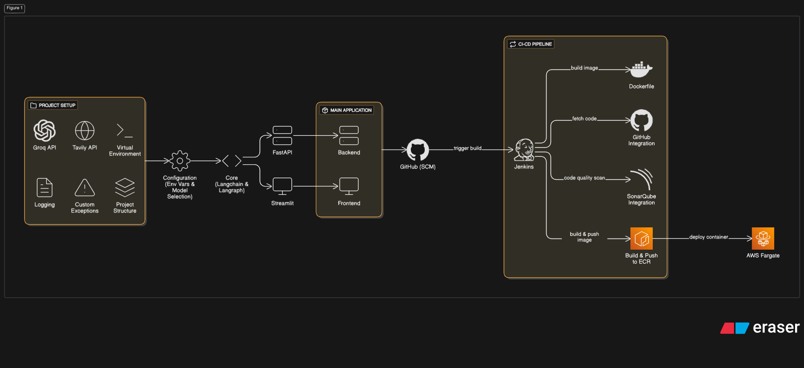
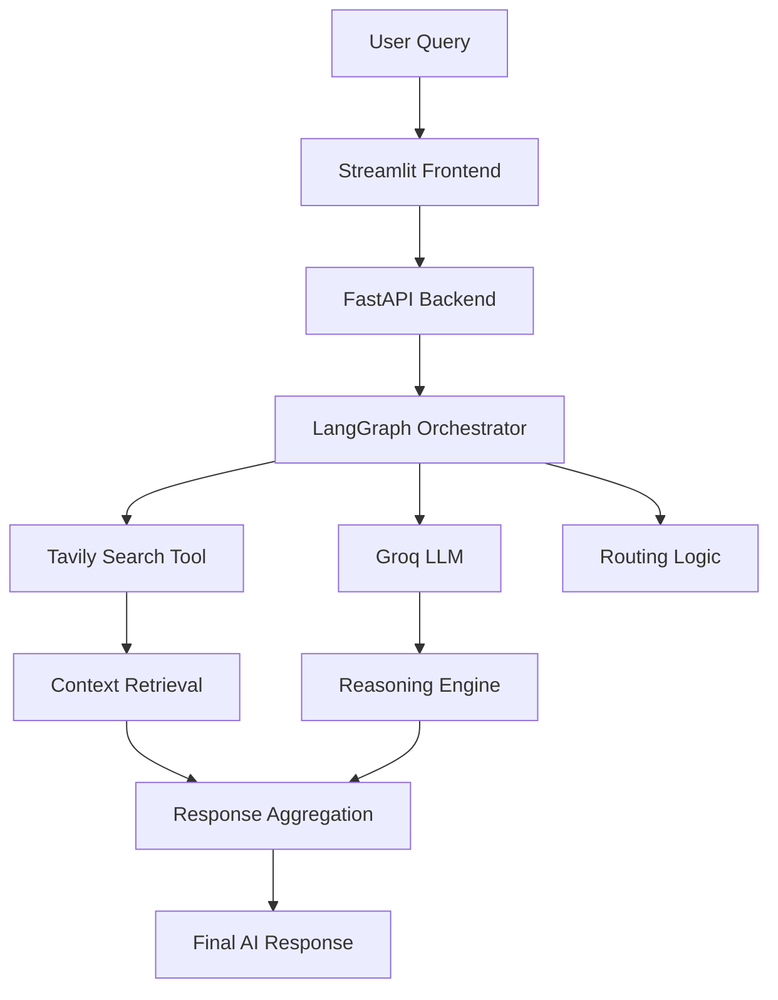
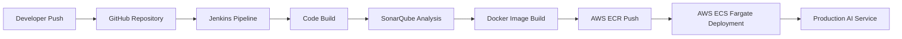
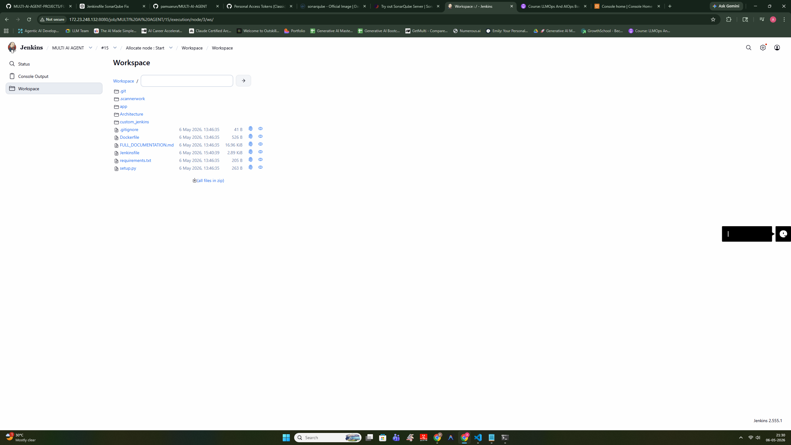
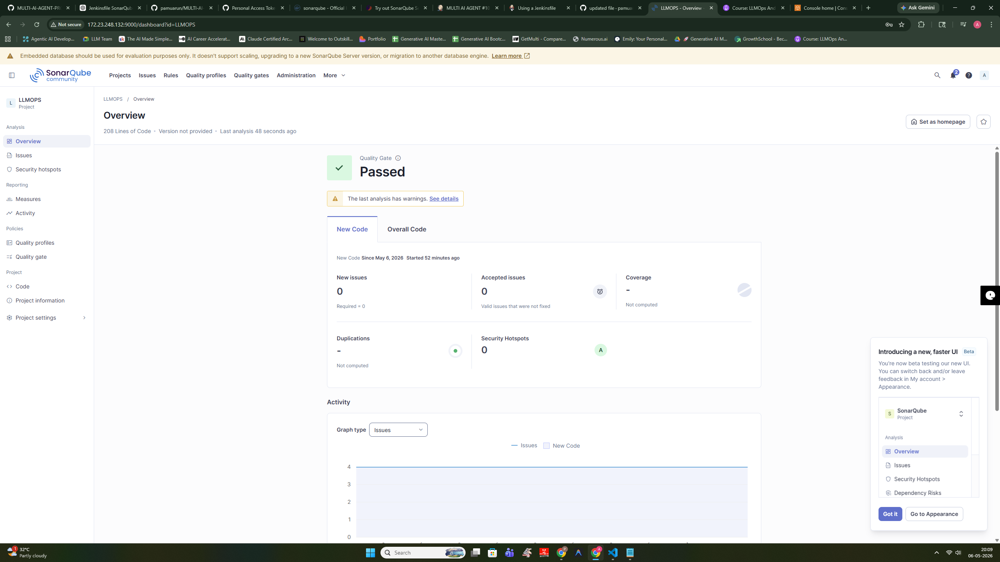

<div align="center">
  
# 🤖 MULTI-AI AGENT: Enterprise LLMOps Platform

### Next-Generation Agentic AI System with Advanced Orchestration, CI/CD Automation, and AWS ECS Deployment



<br>

[](#)
[](#)
[](#)
[](#)
[](#)
[](#)
[](#)
[](#)
[](#)
[](#)
[](#)

</div>

---

# 📖 Executive Overview

**MULTI-AI AGENT** is an enterprise-grade, scalable Agentic AI platform engineered to orchestrate advanced Large Language Model workflows using **LangGraph** and **LangChain**.

The platform demonstrates production-oriented **LLMOps engineering**, integrating:
- Multi-agent orchestration
- Real-time LLM inference
- Intelligent tool routing
- Containerized deployments
- Automated CI/CD pipelines
- Cloud-native infrastructure

Powered by ultra-low latency inference through **Groq**, the system enables dynamic reasoning workflows capable of intelligent decision-making, tool execution, and contextual response generation.

The repository showcases a complete AI engineering lifecycle:
- AI application development
- Agent orchestration
- Backend API engineering
- CI/CD automation
- Code quality governance
- Containerization
- Cloud deployment
- Infrastructure automation

The architecture spans from a modular **FastAPI** backend and interactive **Streamlit** frontend to enterprise-grade deployment pipelines using **Jenkins**, **SonarQube**, **Docker**, and **AWS ECS Fargate**.

---

# 🚀 Key Features & Capabilities

## 🧠 Agentic AI & Generative AI

- Stateful multi-agent orchestration using **LangGraph**
- Dynamic AI workflow routing and execution
- Groq-powered ultra-fast inference architecture
- Context-aware conversational reasoning
- Tool-integrated AI execution pipelines
- Tavily-powered real-time web search integration
- Structured prompt orchestration workflows
- Pydantic-based input/output validation
- Modular AI execution architecture

---

## ⚡ LLMOps & AI Infrastructure

- Enterprise-grade LLMOps architecture
- CI/CD automation using Jenkins
- SonarQube quality gate enforcement
- Modular containerized deployment workflows
- Docker-in-Docker (DinD) Jenkins setup
- Automated deployment pipelines
- AWS ECS Fargate deployment support
- Scalable cloud-native AI infrastructure
- Environment-driven configuration management

---

## 🔐 Engineering & Production Features

- Production-ready FastAPI backend
- Streamlit-based interactive frontend
- Modular code organization
- Reusable agent orchestration components
- Secure environment variable handling
- Cloud deployment workflows
- Infrastructure automation support
- Enterprise deployment architecture

---

# 🧠 Large Language Models (LLMs)

The platform leverages high-performance open-source LLMs served through Groq infrastructure for ultra-low latency inference and advanced agent reasoning workflows.

## Integrated Models

| Model | Purpose |
|---|---|
| `llama-3.3-70b-versatile` | Advanced reasoning, orchestration, contextual response generation |
| `llama-3.1-8b-instant` | Lightweight low-latency conversational inference |

---

## LLM Capabilities

- Multi-step reasoning
- Context-aware generation
- Dynamic orchestration
- Tool-augmented interactions
- Agent-based execution
- Real-time inference workflows
- Structured conversational handling

---

# 🛠️ Technology Stack

| Domain | Technologies |
| :--- | :--- |
| **Language & Backend** | Python 3.10, FastAPI, Uvicorn |
| **Frontend UI** | Streamlit |
| **AI/ML & Agentic AI** | LangChain, LangGraph, Groq, Tavily |
| **LLM Models** | Llama 3.3 70B Versatile, Llama 3.1 8B Instant |
| **Validation & Schemas** | Pydantic |
| **CI/CD Orchestration** | Jenkins, GitHub Webhooks, SonarQube |
| **Containerization** | Docker, Docker-in-Docker (DinD) |
| **Cloud Infrastructure** | AWS ECS Fargate, AWS ECR, IAM |
| **Deployment Strategy** | Containerized Cloud-Native Deployment |

---

# 🏗️ System Architecture

The platform follows a scalable, modular, cloud-native AI architecture designed for enterprise-grade Agentic AI orchestration and deployment workflows.

<div align="center">
  
</div>

---

# 🔄 Agentic AI Workflow



---

# ⚙️ CI/CD & Cloud Deployment Workflow



---

# 🔍 Why LangGraph?

LangGraph was selected to enable:

- Stateful multi-agent workflows
- Dynamic routing logic
- Persistent conversational execution
- Tool-calling orchestration
- Graph-based execution control
- Enterprise-grade agent lifecycle management

Compared to traditional linear LLM pipelines, LangGraph provides significantly greater flexibility, orchestration power, and scalability for complex AI systems.

---

# 🔌 API Architecture

The backend architecture is powered by **FastAPI** and designed using modular API engineering principles.

## Backend Responsibilities

- AI request handling
- Agent orchestration
- Prompt routing
- Tool execution
- LLM communication
- Structured response handling
- Schema validation
- Workflow coordination

---

## API Design Features

- Asynchronous request processing
- Modular route structure
- Pydantic schema validation
- Environment-based configuration
- Production-ready backend architecture
- Scalable API communication patterns

---

# 🏆 Enterprise Engineering Highlights

- Production-grade Agentic AI architecture
- LangGraph-powered orchestration workflows
- Groq-based ultra-fast inference pipelines
- Enterprise LLMOps engineering practices
- Dockerized microservice-ready deployment
- Automated Jenkins CI/CD pipelines
- SonarQube code quality enforcement
- AWS ECS Fargate deployment architecture
- Modular scalable backend engineering
- Infrastructure-oriented deployment workflows

---

# 📈 Performance Optimization

The platform is optimized for:

- Ultra-low latency inference
- Efficient agent orchestration
- Scalable cloud-native deployments
- Lightweight API execution
- Optimized container workflows
- Modular execution pipelines
- Production deployment efficiency

---

# 📂 Project Structure

```text
MULTI-AI-AGENT/
├── app/                      # Core Application Source Code
│   ├── backend/              # FastAPI Backend APIs & Routes
│   ├── frontend/             # Streamlit Frontend Components
│   ├── core/                 # LangGraph Nodes, Agents, Orchestration Logic
│   ├── common/               # Shared Utilities & Helpers
│   ├── config/               # Environment & Configuration Management
│   └── main.py               # Main Application Entry Point
│
├── Architecture/             # System Architecture Diagrams
├── custom_jenkins/           # Jenkins Docker-in-Docker Configuration
├── Outputs/                  # Screenshots & Deployment Outputs
├── Input Queries/            # Test Queries & Evaluation Inputs
├── Jenkinsfile               # Declarative Jenkins Pipeline
├── Dockerfile                # Production Container Definition
├── requirements.txt          # Python Dependencies
├── setup.py                  # Packaging & Installation Configuration
└── FULL_DOCUMENTATION.md     # Detailed Infrastructure Documentation
```

---

# 📸 Outputs & Visual Proof of Execution

The repository contains visual evidence showcasing:
- Local execution
- Agent interaction
- CI/CD execution
- SonarQube validation
- AWS infrastructure provisioning
- Production deployment workflows

<details>
<summary><b>🖼️ View System Outputs & Screenshots</b></summary>

---

## 🖥️ Local Execution

### Streamlit Local Interface


### AI Interaction Workflow


---

## ⚙️ CI/CD Pipeline

### Jenkins Pipeline Execution



### SonarQube Quality Validation



---

## ☁️ AWS Infrastructure

### IAM Configuration


### ECS Cluster Creation


---

## 🚀 Production Deployment

### AWS ECS Deployment Output


### Production AI Service


</details>

---

# 🔐 Security Features

- Environment variable isolation using `.env`
- Secure API key management
- Containerized deployment isolation
- SonarQube-based security validation
- CI/CD credential management
- Cloud IAM integration
- Production deployment separation

---

# 🚦 Getting Started

> [!IMPORTANT]
> A highly detailed deployment and infrastructure guide is available inside:
>
> ```text
> FULL_DOCUMENTATION.md
> ```

---

# 🚀 Quick Local Setup

## 1️⃣ Clone Repository

```bash
git clone https://github.com/Antigravity/MULTI-AI-AGENT.git
cd MULTI-AI-AGENT
```

---

## 2️⃣ Install Dependencies

```bash
pip install -r requirements.txt
```

---

## 3️⃣ Configure Environment Variables

Create a `.env` file:

```env
GROQ_API_KEY=your_groq_key
TAVILY_API_KEY=your_tavily_key
```

---

## 4️⃣ Run Application

```bash
python app/main.py
```

---

# ☁️ Cloud & Deployment Infrastructure

The platform supports:
- AWS ECS Fargate deployment
- AWS ECR container registry
- Dockerized deployment workflows
- Jenkins-based deployment automation
- Cloud-native AI service execution
- Scalable infrastructure provisioning

---

# 📖 Infrastructure Documentation

The repository includes comprehensive infrastructure documentation covering:

- WSL setup
- Docker DinD configuration
- Jenkins installation
- SonarQube integration
- AWS IAM setup
- ECS cluster creation
- ECR repository setup
- CI/CD automation workflows
- Deployment architecture

Refer to:

```text
FULL_DOCUMENTATION.md
```

---

# 🌍 Real-World Applications

- Enterprise AI Assistants
- Multi-Agent AI Systems
- AI Workflow Automation
- Production LLM Applications
- AI Infrastructure Platforms
- Tool-Augmented AI Systems
- Intelligent Orchestration Engines
- Cloud-Native AI Platforms

---

# 🚀 Future Roadmap

- Persistent conversational memory
- Autonomous planning agents
- Multi-modal AI support
- Vector database integration
- Retrieval-Augmented Generation (RAG)
- Distributed agent execution
- Kubernetes orchestration
- AI observability dashboards
- Agent benchmarking systems
- Human-in-the-loop workflows

---

# 🏗️ Architectural Decisions

| Decision | Reason |
|---|---|
| LangGraph | Stateful agent orchestration |
| FastAPI | High-performance async backend |
| Groq | Ultra-low latency inference |
| Docker | Portable deployment workflows |
| Jenkins | Automated CI/CD pipelines |
| SonarQube | Code quality & security validation |
| AWS ECS Fargate | Scalable serverless containers |

---

# 🛡️ License & Authorship

Developed and architected as an enterprise-grade Agentic AI & LLMOps demonstration platform.

Documentation, orchestration workflows, infrastructure pipelines, and deployment engineering maintained by **Antigravity**.

---

<div align="center">

### 🚀 Built with Agentic AI, LLMOps, Cloud Infrastructure & Enterprise AI Engineering

</div>
